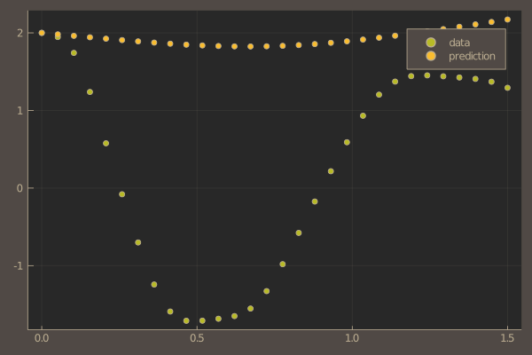

# Neural ODEs with DiffEqFlux
Let's see how easy it is to make dense neural ODE layers from scratch.
Flux is used here just for the `glorot_uniform` function and the `ADAM` optimizer.

This example is taken from [the DiffEqFlux documentation](https://diffeqflux.sciml.ai/dev/Flux/). 

```julia
using ComponentArrays
using OrdinaryDiffEq
using Plots
using UnPack

using DiffEqFlux: sciml_train
using Flux: glorot_uniform, ADAM
using Optim: LBFGS
```

First, let's set up the problem and create the truth data.
```julia
u0 = Float32[2.; 0.]
datasize = 30
tspan = (0.0f0, 1.5f0)

function trueODEfunc(du, u, p, t)
    true_A = [-0.1 2.0; -2.0 -0.1]
    du .= ((u.^3)'true_A)'
end

t = range(tspan[1], tspan[2], length = datasize)
prob = ODEProblem(trueODEfunc, u0, tspan)
ode_data = Array(solve(prob, Tsit5(), saveat = t))
```

Next we'll make a function that creates dense neural layer components. It is similar to `Flux.Dense`, except it doesn't handle the activation function. We'll do that separately.
```julia
dense_layer(in, out) = ComponentArray{Float32}(W=glorot_uniform(out, in), b=zeros(out))
```

Our parameter vector will be a `ComponentArray` that holds the ODE initial conditions and the dense neural layers.
```julia
layers = (L1=dense_layer(2, 50), L2=dense_layer(50, 2))
θ = ComponentArray(u=u0, p=layers)
```

We now have convenient struct-like access to the weights and biases of the layers for our neural ODE function while giving our optimizer something that acts like a flat array.
```julia
function dudt(u, p, t)
    @unpack L1, L2 = p
    return L2.W * tanh.(L1.W * u.^3 .+ L1.b) .+ L2.b
end

prob = ODEProblem(dudt, u0, tspan)
```
```julia
predict_n_ode(θ) = Array(solve(prob, Tsit5(), u0=θ.u, p=θ.p, saveat=t))

function loss_n_ode(θ)
    pred = predict_n_ode(θ)
    loss = sum(abs2, ode_data .- pred)
    return loss, pred
end
loss_n_ode(θ)
```

Let's set up a training observation callback and train!
```julia
cb = function (θ, loss, pred; doplot=false)
    display(loss)
    # plot current prediction against data
    pl = scatter(t, ode_data[1,:], label = "data")
    scatter!(pl, t, pred[1,:], label = "prediction")
    display(plot(pl))
    return false
end
cb(θ, loss_n_ode(θ)...)

data = Iterators.repeated((), 1000)

res1 = sciml_train(loss_n_ode, θ, ADAM(0.05); cb=cb, maxiters=100)
cb(res1.minimizer, loss_n_ode(res1.minimizer)...; doplot=true)

res2 = sciml_train(loss_n_ode, res1.minimizer, LBFGS(); cb=cb)
cb(res2.minimizer, loss_n_ode(res2.minimizer)...; doplot=true)
```

