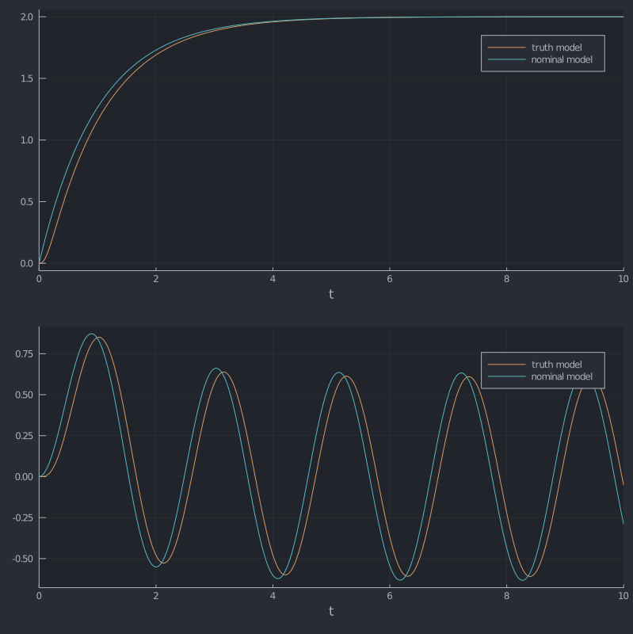
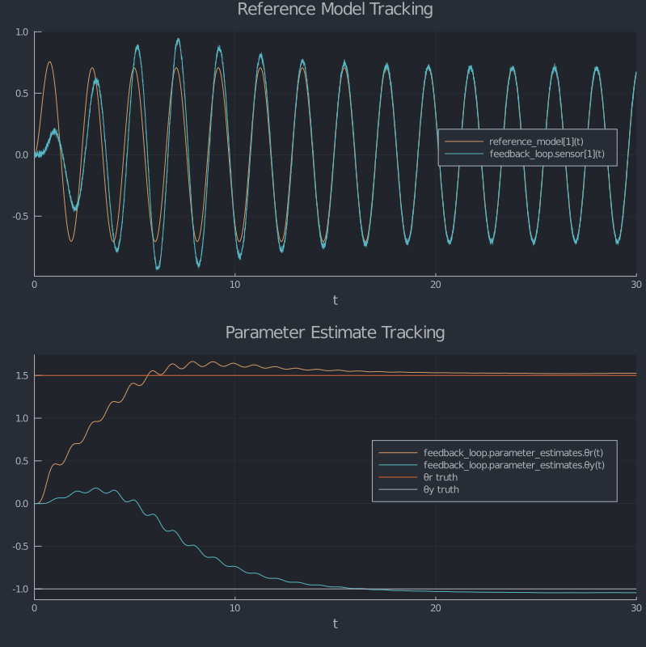
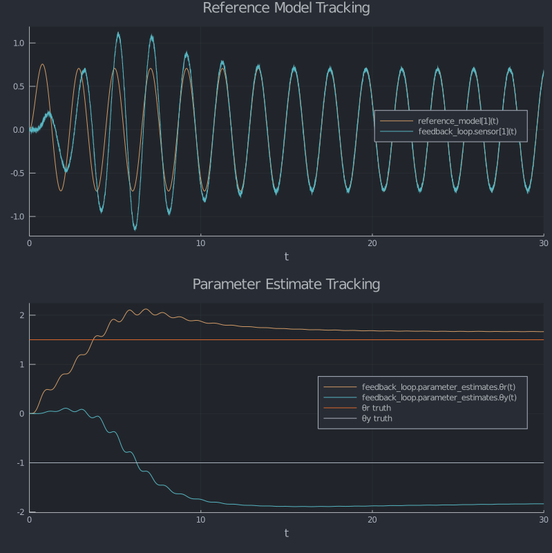
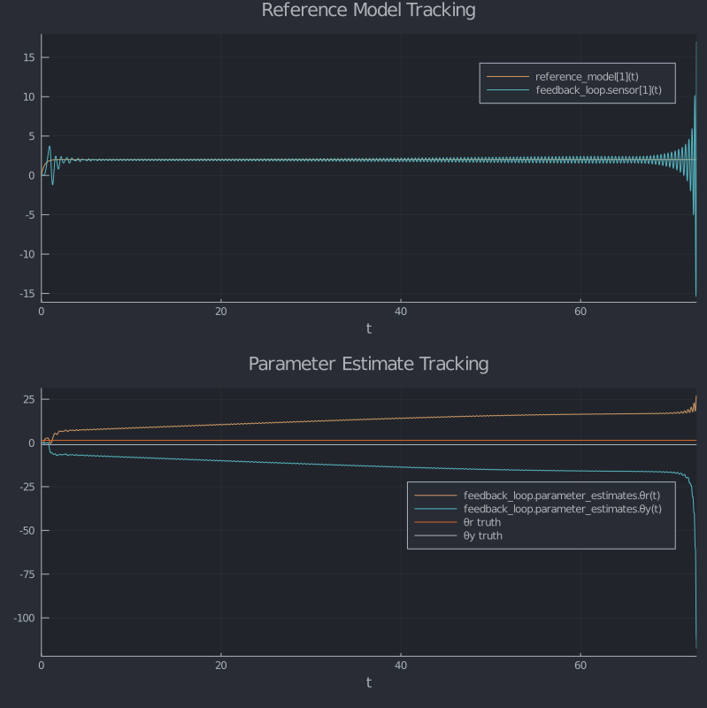

# Model Reference Adaptive Control
## Motivation
Adaptive control is a good example of the type of problem that would be difficult to handle in a differential equations library without some sort of component system. We'll see how easy `ComponentArray`s make it to swap out subsystems, even when they have a different number of internal states.

This specific example will walk through a typical adaptive control problem with online parameter estimation. For offline parameter estimation, check out the [DifferentialEquations.jl docs](https://docs.sciml.ai/stable/analysis/parameter_estimation/).

```julia
using ComponentArrays
using ControlSystems
using DifferentialEquations
using UnPack
using Plots
```

## Helper Functions
These helper functions will eventually make it into a separate package aimed at simulating control systems problems. The idea is to make it easier to bring linear models from [ControlSystems.jl](https://github.com/JuliaControl/ControlSystems.jl) into nonlinear simulations in [DifferentialEquations.jl](https://github.com/SciML/DifferentialEquations.jl). For now, we'll just define everything we need here.

First, we need a way to apply inputs to the system through keyword arguments. These
will help us pass in inputs as either values or functions of (x,p,t).
```julia
maybe_apply(f::Function, x, p, t) = f(x, p, t)
maybe_apply(f, x, p, t) = f

function apply_inputs(func; kwargs...)
    simfun(dx, x, p, t) = func(dx, x, p, t; map(f->maybe_apply(f, x, p, t), (;kwargs...))...)
    simfun(x, p, t) = func(x, p, t; map(f->maybe_apply(f, x, p, t), (;kwargs...))...)
    return simfun
end

```
Next, we need a way to create derivative functions from transfer functions. In ControlSystems.jl
there is a function called `simulator` that does this, but the inputs must be applied from
the start so we couldn't use it as a component function. Our version allows inputs to be
passed through the keyword arguments and, as an added convenience, is in observer canonical
form so our first element of `x` is also the output `y` (note that while this is true for
our problem, it isn't always going to be the case).
```julia
SISO_simulator(P::TransferFunction) = SISO_simulator(ss(P))
function SISO_simulator(P::AbstractStateSpace)
    @unpack A, B, C, D = P

    if size(D)!=(1,1)
        error("This is not a SISO system")
    end

    # Put into observer canonical form so the first element is also the y value
    BB = reverse(vec(C))
    CC = reverse(vec(B))'
    DD = D[1,1]
    
    return function sim!(dx, x, p, t; u=0.0)
        dx .= A*x + BB*u
        return CC*x + DD*u
    end
end
```

## Laplace Domain Model Specification
Using ControlSystems.jl we'll make a Laplace variable `s`.
```julia
s = tf("s")
```

We can build a reference model in the Laplace domain
```julia
am = 3
bm = 3
ref_model = bm / (s + am)
ref_sim! = SISO_simulator(ref_model)
```

and our plant model as well. The nominal plant model structure is what is known to our
adaptation law.
```julia
ap = 1
bp = 2
nominal_plant = bp / (s + ap)
nominal_sim! = SISO_simulator(nominal_plant)
```

To test robustness to uncertainty, we'll also include unmodeled dynamics with an entirely
different structure than our nominal plant model.
```julia
unmodeled_dynamics = 229/(s^2 + 30s + 229)
truth_plant = nominal_plant * unmodeled_dynamics
truth_sim! = SISO_simulator(truth_plant)
```
 
 Let's do a quick sanity check to make sure our nominal and truth plant dynamics are about the same. We'll use the `apply_inputs` function to plot a step response and a sine response.
 ```julia
step_p = plot(solve(ODEProblem(apply_inputs(truth_sim!; u=1), truth_ic, (0.0, 10.0))); vars=1, label="truth model")
plot!(step_p, solve(ODEProblem(apply_inputs(nominal_sim!; u=1), nominal_ic, (0.0, 10.0))); vars=1, label="nominal model")

u = (x,p,t) -> sin(3t)
sin_p = plot(solve(ODEProblem(apply_inputs(truth_sim!; u=u), truth_ic, (0.0, 10.0))); vars=1, label="truth model")
plot!(sin_p, solve(ODEProblem(apply_inputs(nominal_sim!; u=u), nominal_ic, (0.0, 10.0))); vars=1, label="nominal model")

plot(step_p, sin_p; layout=(2,1), size=(800, 800))
```


We'll make a first-order sensor as well so we can add noise to our measurement.
```julia
τ = 0.005
sensor_plant = 1 / (τ*s + 1)
sensor_sim! = SISO_simulator(sensor_plant)
```


## Derivative Functions
Our control law assumes perfect knowledge of the parameters that are attached to the
regressors (which are the reference input and the model output)
```julia
control(θ, w) = θ'w
```

We'll use a simple gradient descent adaptation law
```julia
function adapt!(Dθ, θ, γ, t; e, w)
    Dθ .= -γ*e*w
    return nothing
end
```

Our feedback loop takes in the reference model output `ym` and the input signal `r`,
calculates the control signal `u`, feeds that into the plant model, calculates the reference
tracking error `e`, and finally updates feeds the reference tracking error and it's corresponding
regressor vector to the adaptation law.
```julia
function feedback_sys!(D, vars, p, t; ym, r, n)
    @unpack parameter_estimates, plant_model, sensor = vars
    γ = p.gamma
    regressor = [r, plant_model[1]]

    u = control(parameter_estimates, regressor)
    yp = p.plant_fun(D.plant_model, plant_model, (), t; u=u)
    ŷ = sensor_sim!(D.sensor, sensor, (), t; u=yp[1]) + n
    e = ŷ .- ym
    regressor[2] = ŷ
    adapt!(D.parameter_estimates, parameter_estimates, γ, t; e=e, w=regressor)
    return yp
end
```

Now the full system takes in an input signal `r`, feeds it through the reference model,
and feeds the output of the reference model `ym` and the input signal to `feedback_sys`.
```julia
function system!(D, vars, p, t; r=0.0, n=0.0)
    @unpack reference_model, feedback_loop = vars

    ym = ref_sim!(D.reference_model, reference_model, (), t; u=r)
    yp = feedback_sys!(D.feedback_loop, feedback_loop, p, t; ym=ym, r=r, n=n)
    return yp
end
```


## Simulation Inputs
```julia
# Simulation time span
tspan = (0.0, 30.0)

# Input signal
input_signal = (x,p,t) -> sin(3t)

# Initial conditions
ref_ic = zeros(1)
nominal_ic = zeros(1)
truth_ic = zeros(3)
sensor_ic = zeros(1)
θ_est_ic = ComponentArray(θr=0.0, θy=0.0)
```


## Set Up Simulation
```julia
function simulate(plant_fun, plant_ic;
                tspan=tspan,
                input_signal=input_signal,
                adapt_gain=1.5,
                noise_param=nothing,
                deterministic_noise=0.0)

    noise(D, vars, p, t) = (D.feedback_loop.sensor[1] = noise_param)

    # Truth control parameters
    θ_truth = (r=bm/bp, y=(ap-am)/bp)

    # Initial conditions
    ic = ComponentArray(
        reference_model = ref_ic,
        feedback_loop = (
            parameter_estimates = θ_est_ic,
            sensor = sensor_ic,
            plant_model = plant_ic,
        ),
    )

    # Model parameters
    p = (
        gamma = adapt_gain,
        plant_fun = plant_fun,
    )

    sim_fun = apply_inputs(system!; r=input_signal, n=deterministic_noise)

    # We can also choose whether we want to include random noise in our model by switching between an ODE
    # and an SDE problem.
    if noise_param === nothing
        prob = ODEProblem(sim_fun, ic, tspan, p, max_iters=2000)
    else
        prob = SDEProblem(sim_fun, noise, ic, tspan, p, max_iters=2000)
    end


    ## Solve!
    sol = solve(prob)


    ## Plot
    # Reference model tracking
    top = plot(
        sol,
        vars=["reference_model[1]", "feedback_loop.sensor"],
        legend=:right,
        title="Reference Model Tracking",
    )

    # Parameter estimate tracking
    bottom = plot(sol, vars="feedback_loop.parameter_estimates")
    plot!(
        bottom,
        [tspan...], [θ_truth.r θ_truth.y; θ_truth.r θ_truth.y],
        labels=["θr truth" "θy truth"],
        legend=:right,
        title="Parameter Estimate Tracking",
    )

    # Combine both plots
    plot(top, bottom, layout=(2,1), size=(800, 800))
end
```

And now let's run the simulation and plot.
```julia
simulate(nominal_sim!, nominal_ic; noise_param=0.2)
```


## Unmodeled Dynamics
Notice our parameter estimates are converging to a slightly different number than the truth values. This is because we didn't take the sensor dynamics into account in our adaptation law. Thankfully we are pretty robust to this. Let's push it a little further though. Remember our truth plant model with the extra unmodelled dynamics? Let's plot that one up now. Notice how easy it `ComponentArray`s make it to switch out the two simulations, despite the fact that the two plant models have a different number of states. 

```julia
simulate(truth_sim!, truth_ic; noise_param=0.2)
```


Even though our parameters aren't tracking what we think they should be, we are still tracking our reference model well. In real systems, there are always going to be unaccounted-for dynamics, so it's important that we are robust to that.

## Insufficient Excitation and Rohr's Example
Readers familiar with adaptive control might have noticed that our plant model parameters weren't just arbitrarily chosen; they come from Rohr's well-known example of parameter drift for insufficient excitation. To see this in action, let's look at what happens when we feed our model a stationary input. We'll switch to the same purely deterministic noise model that Rohr used. The parameter adaptation gain is a best guess to match the original data.
```julia
simulate(nominal_sim!, nominal_ic;
        input_signal = 2.0,
        deterministic_noise = (x,p,t) -> 0.5sin(16.1t),
        noise_param = nothing,
        tspan = (0.0, 100.0),
        adapt_gain = 3.35)
```


Interesting. If we were just looking at the model reference tracking, it would seem that everything is okay. The parameters are drifting within a space that keeps the reference tracking error small. This is pretty typical for "insufficiently excited" systems, i.e. systems whose input is either flat or at frequencies that are attenuated by the plant dynamics. Now let's see what happens with our truth model.
```julia
simulate(truth_sim!, truth_ic;
           input_signal = 2.0,
           deterministic_noise = (x,p,t) -> 0.5sin(16.1t),
           noise_param = nothing,
           tspan = (0.0, 72.9),
           adapt_gain = 3.35)
```


Yikes! It looks like that parameter drift can lead to system instability. We won't go into the strategies to mitigate this problem here, but if you're interested, check out Slotine and Li's [Applied Nonlinear Control](https://books.google.com/books/about/Applied_Nonlinear_Control.html?id=cwpRAAAAMAAJ&source=kp_book_description).